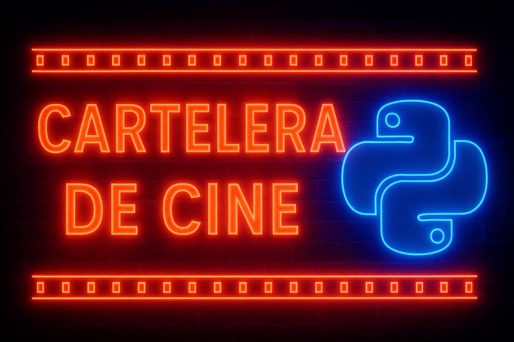

  

  
  

   
🎥 Cartelera de Cine en Python

Backend profesional para la gestión integral de una cartelera digital cinematográfica

Bienvenido al repositorio oficial de Cartelera de Cine, una aplicación desarrollada en Python cuyo objetivo es gestionar de forma eficiente la cartelera digital de un cine. Este proyecto forma parte del itinerario formativo Python + Inteligencia Artificial, integrando programación estructurada, POO, bases de datos, APIs y arquitectura web moderna.

🎯 Finalidad del Proyecto

El sistema se ha diseñado como un backend completo capaz de:

📌 Mostrar información de películas disponibles en cartelera.

🕒 Gestionar horarios y salas.

🎫 Administrar ventas de entradas y precios.

🎭 Organizar géneros y clasificaciones.

👥 Gestionar usuarios, autenticación y socios.

📚 Aplicar POO, estructuras de datos y buenas prácticas de desarrollo.

🚀 Integrar tecnologías modernas como FastAPI y SQLAlchemy.

👥 Equipo de Desarrollo

Javier Cachón Garrido

Kary Haro Pérez

Manuel Jesús Marín García

Reyes Delestal Barrios

Iñaki Huete Montes

🛠️ Tecnologías Utilizadas

Python 3

FastAPI

SQLAlchemy (ORM)

SQLite

Jinja2

Bootstrap 4/5

HTML5, CSS3, JavaScript

SQL

Visual Studio Code

🏛️ Arquitectura del Sistema

El proyecto adopta una arquitectura modular, separando:

Entidades de dominio

Lógica de negocio

Servicios (endpoints REST, vistas HTML)

Capa de persistencia (ORM + SQLite)

Esto facilita la escalabilidad, el mantenimiento y la integración con futuros frontends.

📁 Estructura del Proyecto
.
├── app/
│   ├── main.py
│   ├── models/
│   │   ├── pelicula.py
│   │   ├── genero.py
│   │   ├── sala.py
│   │   ├── horario.py
│   │   ├── venta.py
│   │   ├── socio.py
│   │   └── login.py
│   ├── routes/
│   │   ├── peliculas.py
│   │   ├── generos.py
│   │   ├── salas.py
│   │   ├── horarios.py
│   │   ├── ventas.py
│   │   ├── socios.py
│   │   └── login.py
│   ├── database/
│   │   ├── db.py
│   │   ├── db.sql
│   │   └── cartelera_cine.db
│   ├── templates/
│   │   ├── base.html
│   │   ├── peliculas/
│   │   ├── generos/
│   │   ├── salas/
│   │   ├── horarios/
│   │   ├── ventas/
│   │   ├── socios/
│   │   └── login/
│   └── static/
│       ├── css/
│       ├── js/
│       └── img/
├── requirements.txt
├── README.md
└── run.py

🎬 Entidades del Sistema

A continuación se describen todas las entidades, sus campos, sus responsabilidades y las relaciones entre ellas.

🎞️ Pelicula

Responsable: Javier Cachón

Representa una película disponible o no en la cartelera.

Campos

id: int

titulo: string

genero_id: int (FK → generos.id)

duracion: int

director: string

descripcion: string

trailer: string

productora: string

idioma: string

VOSE: boolean

actores: lista

disponible: boolean

Relaciones

Pelicula → Género (N:1)

Pelicula → Horario (1:N, navegación desde Horario)

Servicios

Crear, listar, editar y eliminar películas

Búsquedas avanzadas y filtrado (futuro)

🏟️ Sala

Responsable: Reyes

Representa una sala física del cine.

Campos

id

numero

capacidad

tipo (normal, 3D, IMAX, premium)

precio_base

Relaciones

Sala → Horarios (1:N)

Servicios

CRUD de salas

Mantenimiento y suplementos futuros

🕒 Horario

Responsable: Manuel

Sesión concreta de una película en una sala.

Campos

id

pelicula_id

sala_id

hora

disponible

Relaciones

Horario → Película

Horario → Sala

Horario → Ventas

Servicios

Crear, listar, editar y cancelar horarios

💳 Venta

Responsable: Iñaki

Representa la compra de entradas.

Campos

id

horario_id

precio_total

cantidad

metodo_pago

socio_id (opcional)

Relaciones

Venta → Horario

Venta → Socio (opcional)

Servicios

Registrar ventas

Consultas de recaudación

Tickets (futuro)

🏷️ Género

Responsable: Kary

Campos

id

nombre

descripcion

Relaciones

Género → Peliculas

Servicios

CRUD de géneros

🔐 Login / Autenticación

Responsable: Javier Cachón

Campos

id

username

email

password_hash

rol

activo

bloqueado

creado_en

actualizado_en

Relación

Login → Socio (0..1 : 1)

Servicios

Registro, login, logout

Cambiar contraseña

Gestión de estados

2FA futuro

👥 Socio / Fidelización

Responsable: Javier Cachón

Campos

id

numero_socio

login_id (opcional)

email

nivel

puntos

fecha_alta

activo

Relaciones

Socio ↔ Login

Socio → Ventas

Servicios

Gestión integral de socios

Puntos, niveles, historial

🔗 Modelo de Datos y Relaciones

Resumen simplificado:

generos (1) ────< (N) peliculas
peliculas (1) ────< (N) horarios >──── (1) salas
horarios (1) ────< (N) ventas
logins (1) ────(0..1) socios
socios (1) ────< (N) ventas   (opcional)

📦 Instalación de Dependencias
1. Clonar repositorio
git clone https://github.com/HueteDevs/Proyecto_Adecco
cd Proyecto_Adecco

2. Crear entorno virtual
python3 -m venv .venv
source .venv/bin/activate

3. Instalar dependencias
pip install -r requirements.txt

▶️ Ejecución del Proyecto
1. Servidor de desarrollo
uvicorn app.main:app --reload

Documentación automática:

http://127.0.0.1:8000/docs

http://127.0.0.1:8000/redoc

2. Ejecutar desde run.py
python run.py

🗄️ Base de Datos
Archivos clave

app/database/db.py

app/database/db.sql

app/database/cartelera_cine.db

Regenerar base de datos (desarrollo)

Basta con eliminar el archivo .db y volver a ejecutar la aplicación.

🌐 Endpoints FastAPI

Los endpoints están organizados por módulos:

/peliculas

/generos

/salas

/horarios

/ventas

/socios

/auth

Ejemplo de uso en main.py:

app.include_router(peliculas.router, prefix="/peliculas", tags=["Películas"])
app.include_router(generos.router,   prefix="/generos",   tags=["Géneros"])
